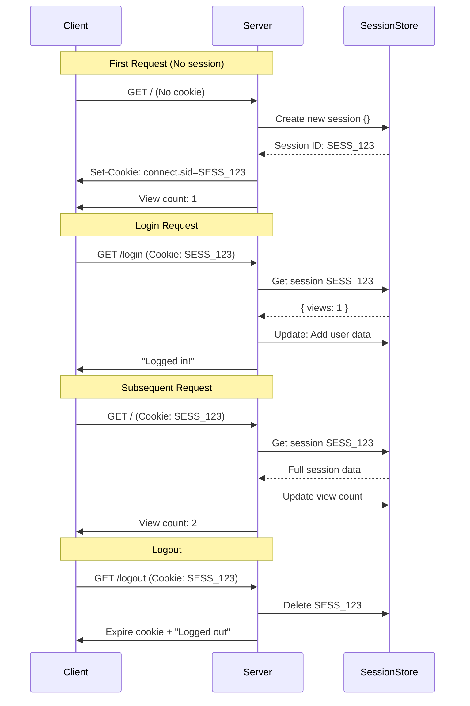

# ================================================================================================== #
Let's break down the code flow and purpose step by step:

### Purpose of this Application
This application demonstrates **session management** in Express.js. It allows the server to:
1. Remember client-specific data between requests
2. Track user activity (page views)
3. Simulate user authentication
4. Maintain state across HTTP requests (which are otherwise stateless)


Let me clarify the session flow step-by-step with a focus on what happens behind the scenes. I'll use a concrete example of a user interacting with your application:

### Session Flow Explained (Step-by-Step)

#### 1. **First Request (No Session Exists)**
- **User**: Visits `http://localhost:3000/`
- **Server**:
  - Creates new session object: `{}` (empty)
  - Generates unique session ID (e.g. `SESS_123abc`)
  - Stores session in session store:
    ```js
    // Session Store
    {
      "SESS_123abc": {}  // Empty session
    }
    ```
- **Response**:
  - Sets cookie in header:
    ```
    Set-Cookie: connect.sid=SESS_123abc; Max-Age=1800; HttpOnly; Path=/
    ```
  - Sends HTML page with view count: `1`

#### 2. **Second Request (Session Exists)**
- **User**: Clicks "Login" link
- **Browser**: Automatically sends cookie:
  ```
  Cookie: connect.sid=SESS_123abc
  ```
- **Server**:
  - Reads session ID from cookie
  - Retrieves session data from store:
    ```js
    // Session Store
    {
      "SESS_123abc": { views: 1 }
    }
    ```
  - Updates session:
    ```js
    req.session.user = { id: 123, name: 'John Doe' };
    req.session.authorized = true;
    ```
  - Saves updated session to store:
    ```js
    // Session Store
    {
      "SESS_123abc": {
        views: 1,
        user: { id: 123, name: 'John Doe' },
        authorized: true
      }
    }
    ```
- **Response**: "Logged in successfully!" (No new cookie sent)

#### 3. **Third Request (Using Session Data)**
- **User**: Returns to home page (`/`)
- **Browser**: Sends cookie:
  ```
  Cookie: connect.sid=SESS_123abc
  ```
- **Server**:
  - Retrieves session from store
  - Updates view count:
    ```js
    req.session.views = 2;  // Incremented from 1
    ```
  - Saves updated session to store:
    ```js
    // Session Store
    {
      "SESS_123abc": {
        views: 2,  // Updated value
        user: { id: 123, name: 'John Doe' },
        authorized: true
      }
    }
    ```
- **Response**: Shows view count `2` and user status

#### 4. **Logout Request**
- **User**: Clicks "Logout"
- **Browser**: Sends cookie
- **Server**:
  - Deletes session from store:
    ```js
    delete sessionStore['SESS_123abc'];
    ```
  - Tells browser to expire cookie:
    ```
    Set-Cookie: connect.sid=; Expires=Thu, 01 Jan 1970 00:00:00 GMT
    ```
- **Response**: "Logged out!"

### Key Concepts Clarified

1. **What the Client Stores**:
   - Only the session ID cookie (e.g. `connect.sid=SESS_123abc`)
   - Never the actual session data
   - Cookie size: Typically 100-200 bytes

2. **What the Session Store Contains**:
   - All session data associated with each session ID
   - Server-side storage (memory, database, Redis, etc.)
   - Stores actual sensitive data (user info, auth status, etc.)

3. **How Session Data is Modified**:
   - When you modify `req.session`:
     ```js
     req.session.views = 5;  // Modification
     req.session.newKey = 'value';  // Modification
     ```
   - The middleware automatically:
     1. Detects changes
     2. Serializes data
     3. Saves to session store
     4. Sends updated cookie if needed (usually only for expiration updates)

4. **Cookie vs. Session Data**:
   | Component       | Stored At    | Content                          | Size       |
   |-----------------|-------------|----------------------------------|------------|
   | Session ID      | Client      | Random unique ID (e.g. SESS_123) | ~100 bytes |
   | Session Data    | Server      | Actual application data          | Unlimited  |

### Visual Flow Diagram



### Critical Points to Remember:
1. **Session data never leaves the server** - only the session ID travels via cookie
2. **Cookie is automatically included** in every request by the browser
3. **Session store is the "source of truth"** - contains all actual session data
4. **Modifications to `req.session`** are automatically saved to the session store
5. **The session ID is the key** that links client cookies to server-side data

This architecture keeps sensitive data secure on the server while maintaining statefulness through the session ID cookie. The session store acts as the secure server-side database for all session data, while the client only holds the minimal key needed to access it.


###  =================================================================================================== ###


### Code Flow Explained:

1. **Initial Setup**:
```javascript
const express = require('express');
const session = require('express-session');
const app = express();
```
- Creates an Express application
- Imports the session middleware

2. **Session Configuration**:
```javascript
app.use(session({ ... }));
```
- Registers the session middleware with configuration:
  - `secret`: Cryptographic key to sign cookies (prevent tampering)
  - `resave`: Only save session if modified (performance optimization)
  - `saveUninitialized`: Don't save empty sessions (privacy)
  - `cookie`: Settings for the session cookie (security and expiration)

3. **Home Route (`/`)**:
```javascript
app.get('/', (req, res) => {
  req.session.views = (req.session.views || 0) + 1;
  // ... send response
});
```
- **First visit**: Creates a new session with `views = 1`
- **Subsequent visits**: Increments the view count
- Shows current view count in HTML
- Provides login/logout links

4. **Login Route (`/login`)**:
```javascript
app.get('/login', (req, res) => {
  req.session.user = { id: 123, name: 'John Doe' };
  req.session.authorized = true;
});
```
- Sets user information in the session
- Flags session as authorized (simulating login)
- Session automatically saves these changes

5. **Logout Route (`/logout`)**:
```javascript
app.get('/logout', (req, res) => {
  req.session.destroy(err => { ... });
});
```
- Completely destroys the session
- Removes all session data from the server store
- Clears the session cookie from client

### Session Lifecycle Flow:
1. **First Request**:
   - Client visits `/` with no session cookie
   - Server creates new session with unique ID
   - Sets `views = 1`
   - Sends session ID to client via `Set-Cookie` header

2. **Subsequent Requests**:
   ```mermaid
   sequenceDiagram
   Client->>Server: Request (with session cookie)
   Server->>Session Store: Retrieve session data
   Session Store->>Server: Session object
   Server->>App Logic: req.session available
   App Logic->>Session Store: Update session data
   Server->>Client: Response with updated content
   ```

3. **Login Flow**:
   - Client clicks login link
   - Server adds user data to session
   - Session marked as "authorized"
   - Browser stores updated session cookie

4. **Logout Flow**:
   - Server destroys session data
   - Session store deletes the session
   - Server instructs browser to expire cookie

### Key Session Properties:
1. **`req.session`**:
   - JavaScript object stored server-side
   - Automatically persisted across requests
   - Unique to each client

2. **Session ID Cookie**:
   - Automatically created (named `connect.sid`)
   - Sent with every subsequent request
   - Contains signed session ID (not actual data)

3. **Session Store**:
   - Where session data is physically stored
   - Default: Memory (not suitable for production)
   - Production: Redis, MongoDB, etc.

### Why Sessions Matter:
1. **User Authentication**: Persist login state
2. **Personalization**: Remember user preferences
3. **Tracking**: Analyze user behavior
4. **Security**: Maintain CSRF tokens
5. **E-commerce**: Shopping cart persistence

### Visualizing the Flow:
```
Client          Server          Session Store
  |               |                   |
  |-- Request1 -->|                   |
  |               |<-- Create Session | 
  |<-- Cookie ----|                   |
  |               |                   |
  |-- Request2 -->|                   |
  | (with cookie) |<-- Get Session -->|
  |               |-- Update Views -->|
  |<-- Page 2 ----|                   |
  |               |                   |
  |-- Login ----->|                   |
  |               |-- Store User ---->|
  |<-- Logged in -|                   |
  |               |                   |
  |-- Logout ---->|                   |
  |               |<-- Destroy Session|
  |<-- Logged out |                   |
```

This implementation shows how sessions create stateful experiences on top of stateless HTTP. The session data is securely stored server-side, while only a session ID travels with the client.

###  =================================================================================================== ###
